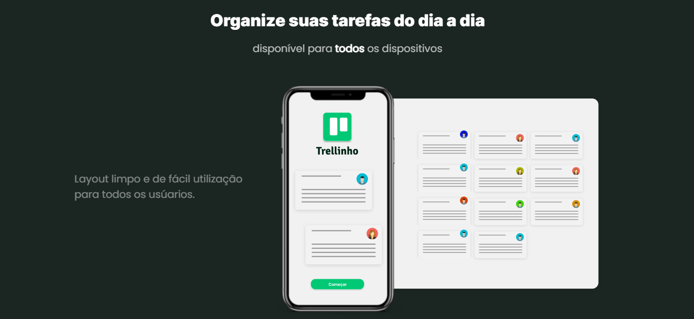

# Trellinho

Projeto sendo realizado com afins de aprimorar estudos com front-end. O projeto tem a finalizade de ajudar as pessoas em organizar suas tarefas diárias sendo assim, um bloco de notas web de fácil acesso.

## Tecnologias utilizadas:
- Angular
- SCSS
- Firebase
- Figma
